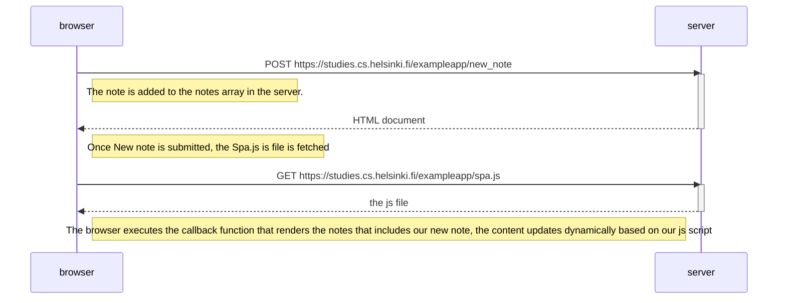

```mermaid
sequenceDiagram
participant browser
participant server

    browser->>server: POST https://studies.cs.helsinki.fi/exampleapp/new_note
    activate server
    Note right of browser: The note is added to the notes array in the server.
    server-->>browser: HTML document
    deactivate server

Note right of browser: Once New note is submitted, the Spa.js is file is fetched

    browser->>server: GET https://studies.cs.helsinki.fi/exampleapp/spa.js
    activate server
    server-->>browser: the js file
    deactivate server


    Note right of browser: The browser executes the callback function that renders the notes that includes our new note, the content updates dynamically based on our js script
```
